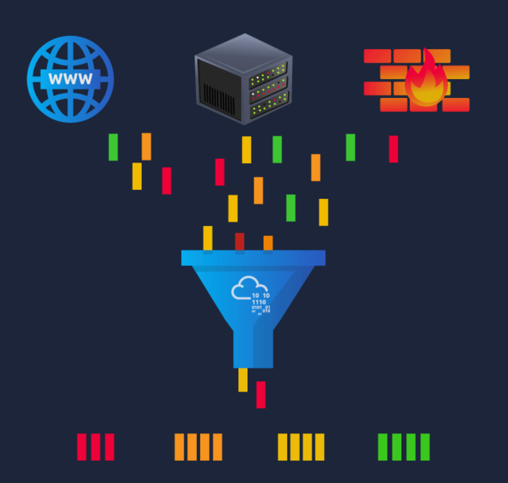
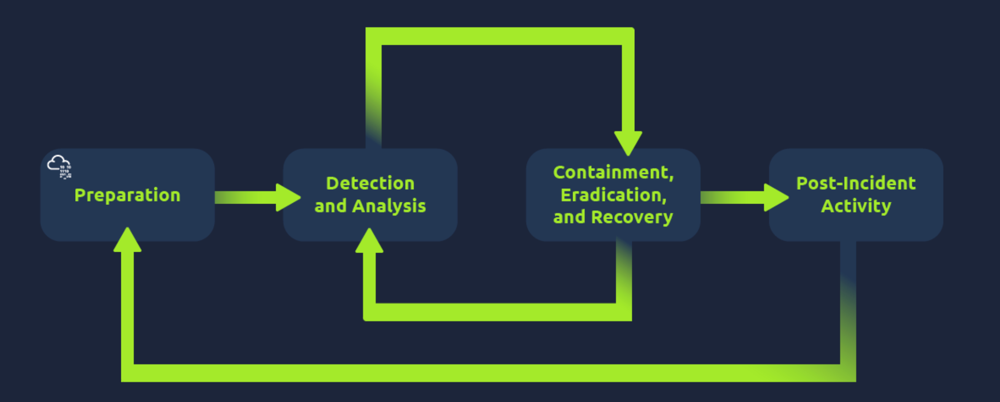
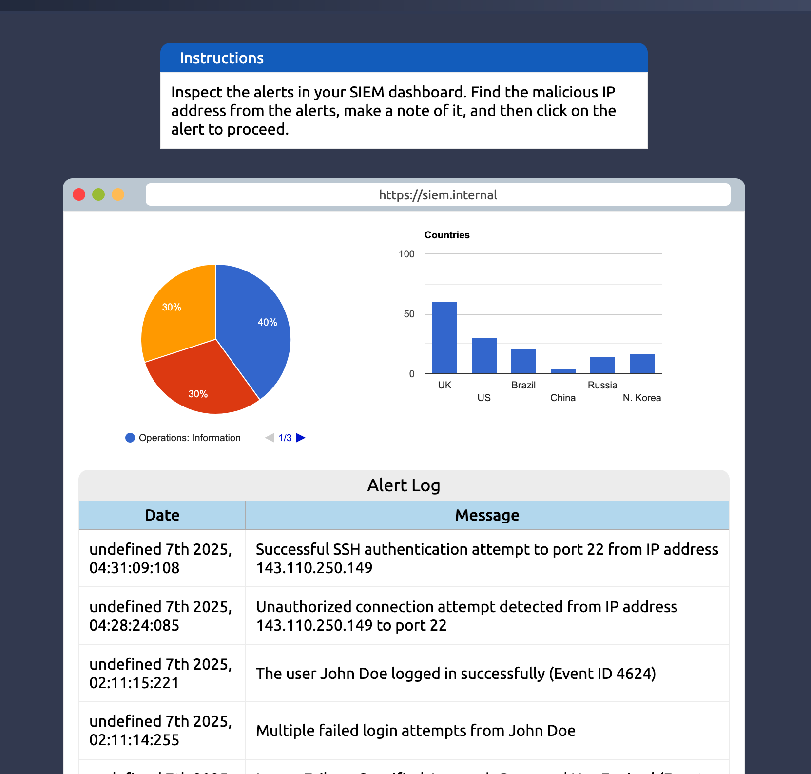
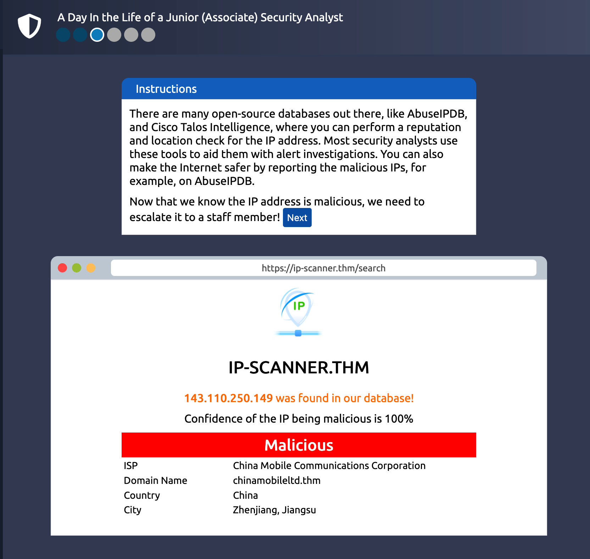
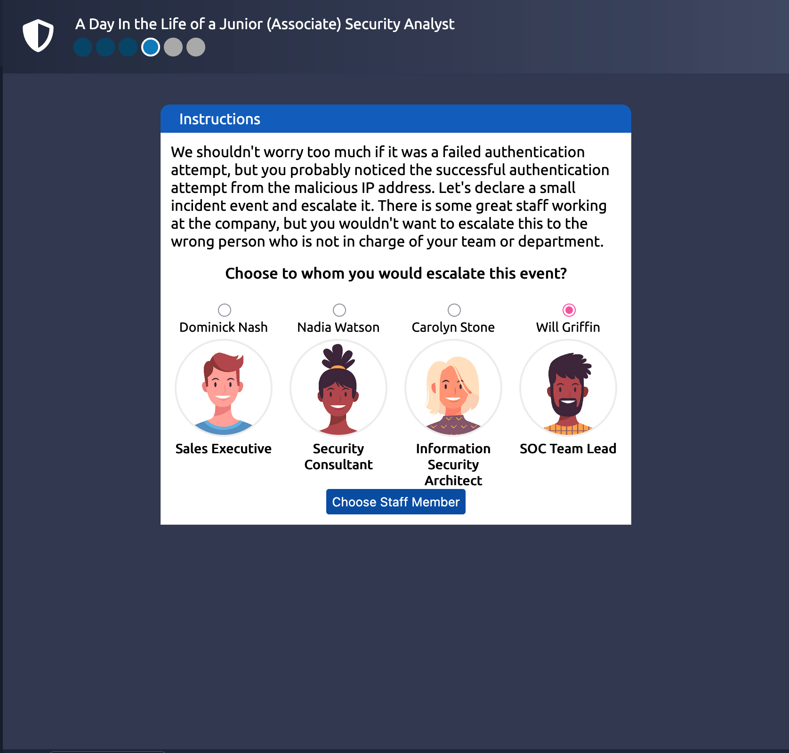
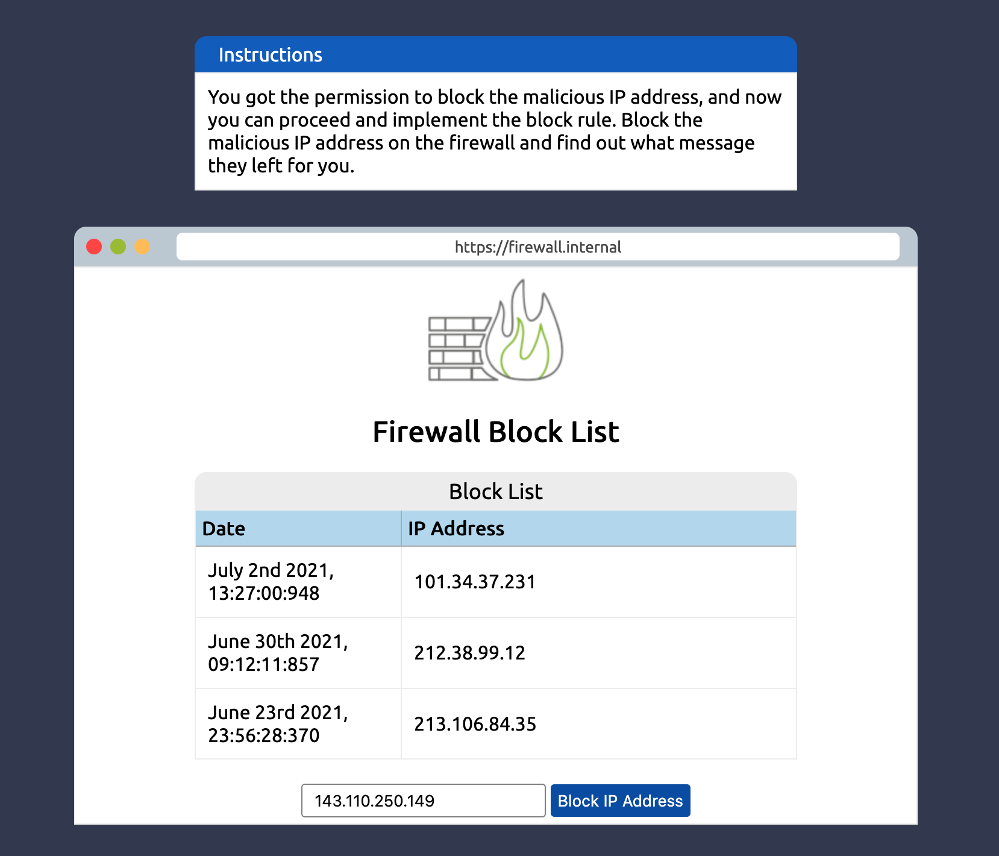
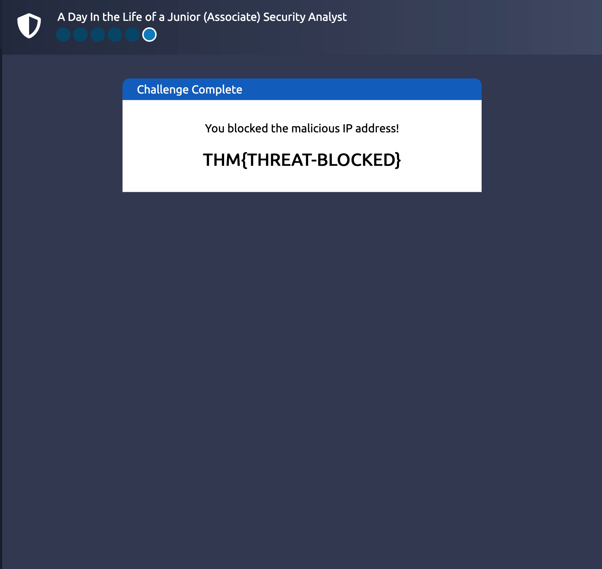

# 🛡️ Defensive security introduction(ROOM2)

## 📝 Summary
### =>Task1
Learnt about defensive security 
#### Defensive security team is also known as blue team, major roles of blue team include:-
1. Preventing intrusions
2. Detecting intrusions ,and responding accordingly and properly

#### Blue team accomplish all this by the following methods:-
1. Applying Patches to the vulnerabilities to prevent them from, being exploited.
2. Spreading awareness among other departments and employees.
3. Taking preventive measures, like intrusion prevention systems(IPS) and firewalls.
4. Continuously monitoring devices, logs,networks etc.

### =>Task2
In task 2 , i learnet about Security operations center(SOC) and Digital Forensics and Incident Response(DFIR)
#### SOC areas of interests are:-
1. Vulnerablities identification and patching.
2. Enforcing policies, and watching policy violations(can be specific to the organisation and company they are working with).
3. Monitoring unauthorized activities.
4. Monitoring network intrusions.

SOC ensures protection by various methods, one of them is by using Threat Intelligence.

##### Threat Intelligence
Gathering information about potential and currently existing threats and actual enemies, this process of collecting, processing,and analyzing is known as threat intelligence.
Analyzing will help in predecting the behaviour and motives of the adversary, Threat intelligence aims to create a list of executionable steps and recommendations.

#### Digital Forensics & Incident Response(DFIR)
Forensics is science of investigating crimes, therefore forensics with digital media is known as Digital Forensics.
Analyzing file systems, system logs, system memory and network logs, is all part of digital forensics.

#### Incident Response
The procedure of acting and responding to a cyber attack , and minimize and contain the damage of it , is part of incident response.
Phases of incident response:-
1. Preparation
2. Detection & Analysis
3. Containment, Eradication and Recovery
4. Post-incident activity

#### Malware Analysis
Determining the origin, functioning, and impact of a malware(viruses,trojans,ransomwares,spywares,botnets,rootkits,etc..), is malware analysis. 
There are two types of malware analysis
1. Static(Observation without running the malware)
2. Dynamic(Observation by running the malware in a controlled enviornment)

### =>Task 3
Performed a role of junior security analyst , and Simulated Security information & Event management(SIEM)

#### Steps performed
Analyzed the SIEm Dashboard and found an anomaly(unautorized connection attempt) from ip '143.110.250.149' to port '22' on 7th 2025

 
Then checked the ip address to see if it is malicious or not , there are websites on the internet which let you do it

The details regarding the ip was found on AbuseIPDB(there are databases over the internet which keep the record of malicious ip's, we can also report malicious ip's there).
The ip in our case was found malicious, so now we proceed and escalate the issue and report it to the right person on the team. So we inform about this to 'Will Griffin' who is SOC Team Lead.

After getting the permission to proceed we Blocklist the ip in Firewall, so that there cannot be any further attemps.

## ✅ Findings
1. An Anomaly(Unauthorized connection attempt)

## ⛳️ Flag Captured
THM{THREAT-BLOCKED}

## 🎖️ Success
Successfully Blocked the malicious ip.

## 📕 Learnings
1. What is Defensive Security?
2. What is SOC , DFIR and Malware Analysis?
3. Simulated SIEM

   

