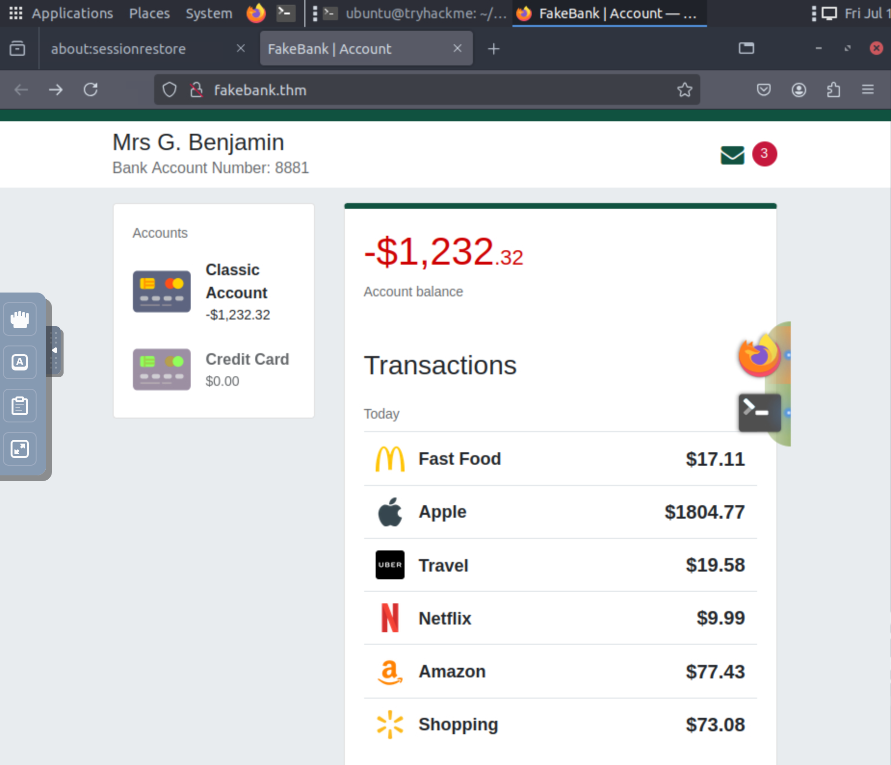
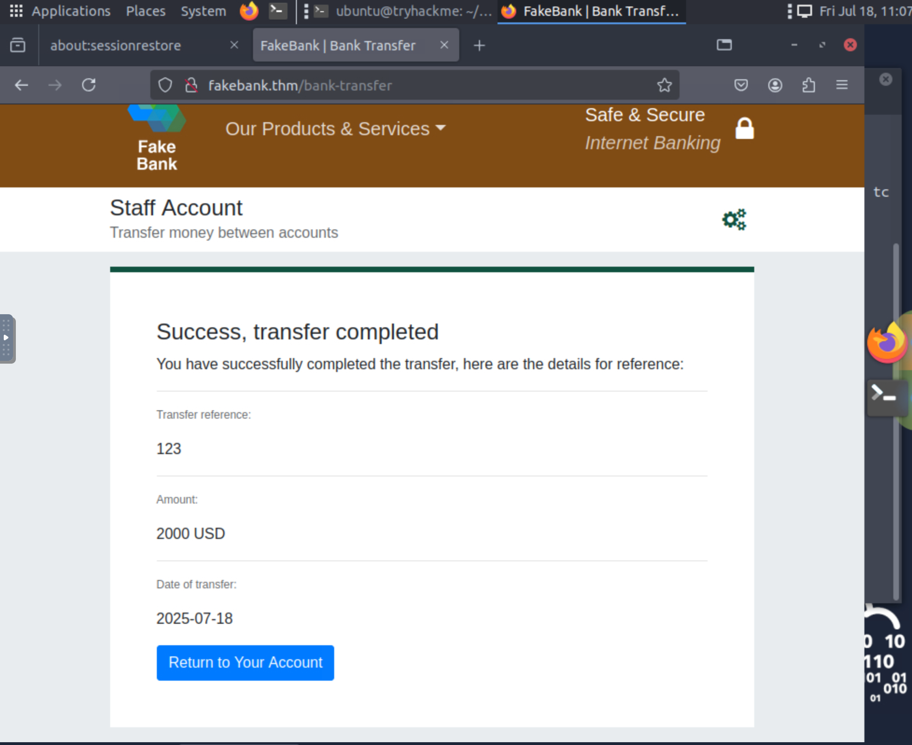

# 🗡️ Offensive security introduction(ROOM1)

## 📝 Summary
### Task1
This was a very basic starting room, and explained, what is offensive security, it's a process of thinkiing like an attacker and breaking into the computer systems, exploiting bugs and finding loopholes in application to gain unauthorized access(but legally), understanding attacker's technique and stratergies, to improve our defences.
### Task2
Got into a virtual setup of a fakebank using gobuster

#### 👨‍💻 Command used
`gobuster -u http://fakebank.thm -w wordlist.txt dir` 

-u is used to specify the website and -w is used to take list of words to iterate.

## ✅ Findings
Found a secret `/bank-transfer` page , which allows tranfer of money from one account to other. 

## 🎖️ Success
Successfully transferred 2000$ from bank account `2276` to bank account `8881`

## 📕 Learnings
1. What is offensive security?
2. What is gobuster and how does it work.
   
